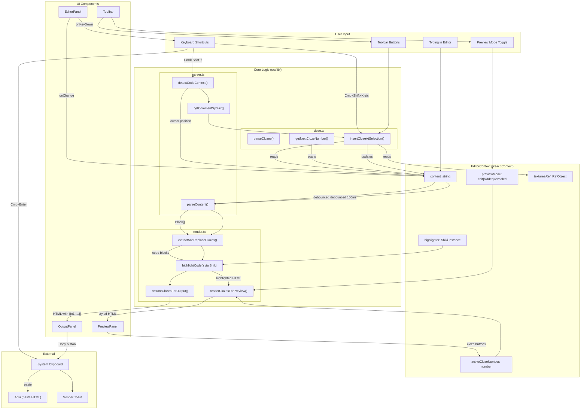
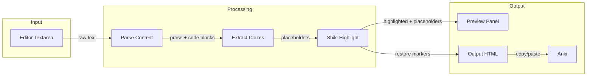
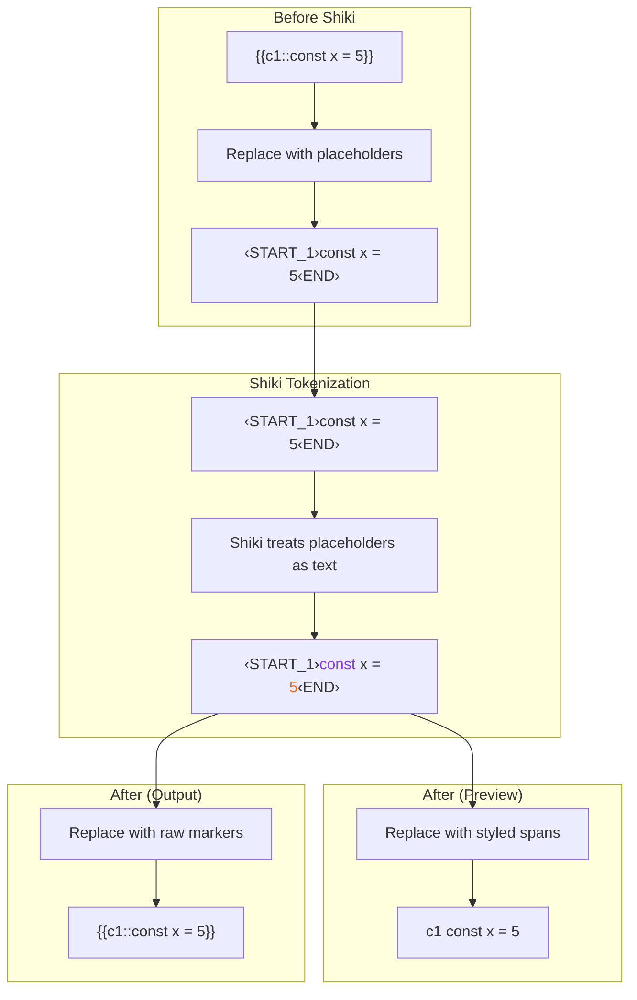
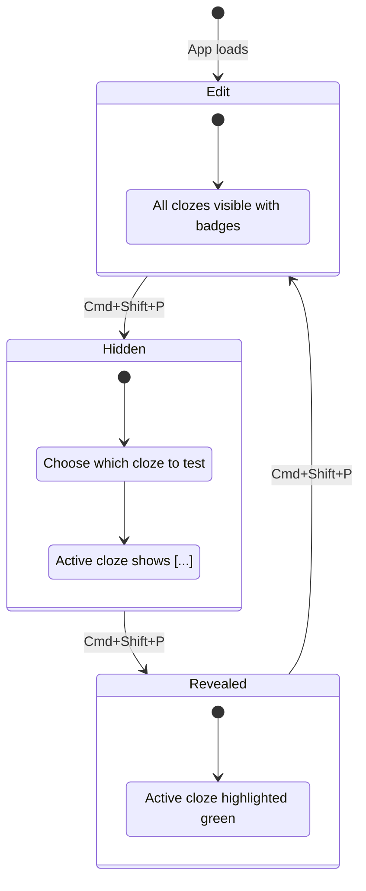

# Anki Code Cards - Data Flow

```mermaid
flowchart TB
    subgraph UserInput["User Input"]
        Typing["Typing in Editor"]
        Shortcuts["Keyboard Shortcuts"]
        Buttons["Toolbar Buttons"]
        ModeToggle["Preview Mode Toggle"]
    end

    subgraph State["EditorContext (React Context)"]
        Content["content: string"]
        PreviewMode["previewMode: edit|hidden|revealed"]
        ActiveCloze["activeClozeNumber: number"]
        Highlighter["highlighter: Shiki instance"]
        TextareaRef["textareaRef: RefObject"]
    end

    subgraph CoreLogic["Core Logic (src/lib/)"]
        subgraph ClozeLib["cloze.ts"]
            ParseClozes["parseClozes()"]
            InsertCloze["insertClozeAtSelection()"]
            GetNextNum["getNextClozeNumber()"]
        end

        subgraph ParserLib["parser.ts"]
            ParseContent["parseContent()"]
            DetectContext["detectCodeContext()"]
            GetComment["getCommentSyntax()"]
        end

        subgraph RenderLib["render.ts"]
            ExtractPlaceholders["extractAndReplaceClozes()"]
            HighlightCode["highlightCode() via Shiki"]
            RenderPreview["renderClozesForPreview()"]
            RenderOutput["restoreClozesForOutput()"]
        end
    end

    subgraph Components["UI Components"]
        Editor["EditorPanel"]
        Preview["PreviewPanel"]
        Output["OutputPanel"]
        Toolbar["Toolbar"]
    end

    subgraph External["External"]
        Clipboard["System Clipboard"]
        Anki["Anki (paste HTML)"]
        Toast["Sonner Toast"]
    end

    %% User Input → State
    Typing --> Content
    Shortcuts --> |"Cmd+Shift+K etc"| InsertCloze
    Buttons --> InsertCloze
    ModeToggle --> PreviewMode

    %% Cloze insertion flow
    InsertCloze --> |"reads"| Content
    InsertCloze --> |"reads"| TextareaRef
    GetNextNum --> |"scans"| Content
    InsertCloze --> |"updates"| Content

    %% Comment cloze flow
    Shortcuts --> |"Cmd+Shift+/"| DetectContext
    DetectContext --> |"cursor position"| Content
    DetectContext --> GetComment
    GetComment --> InsertCloze

    %% Preview rendering flow
    Content --> |"debounced 150ms"| ParseContent
    ParseContent --> |"Block[]"| ExtractPlaceholders
    ExtractPlaceholders --> |"code blocks"| HighlightCode
    Highlighter --> HighlightCode
    HighlightCode --> |"highlighted HTML"| RenderPreview
    PreviewMode --> RenderPreview
    ActiveCloze --> RenderPreview
    RenderPreview --> |"styled HTML"| Preview

    %% Output rendering flow
    Content --> |"debounced 150ms"| ParseContent
    ParseContent --> ExtractPlaceholders
    ExtractPlaceholders --> HighlightCode
    HighlightCode --> RenderOutput
    RenderOutput --> |"HTML with {{c1::...}}"| Output

    %% Copy flow
    Shortcuts --> |"Cmd+Enter"| Clipboard
    Output --> |"Copy button"| Clipboard
    Clipboard --> |"paste"| Anki
    Clipboard --> Toast

    %% Component connections
    Editor --> |"onChange"| Content
    Editor --> |"onKeyDown"| Shortcuts
    Toolbar --> Buttons
    Toolbar --> ModeToggle
    Preview --> |"cloze buttons"| ActiveCloze
```

## Simplified View

```mermaid
flowchart LR
    subgraph Input
        A[Editor Textarea]
    end

    subgraph Processing
        B[Parse Content]
        C[Extract Clozes]
        D[Shiki Highlight]
    end

    subgraph Output
        E[Preview Panel]
        F[Output HTML]
        G[Anki]
    end

    A -->|raw text| B
    B -->|prose + code blocks| C
    C -->|placeholders| D
    D -->|highlighted + placeholders| E
    D -->|restore markers| F
    F -->|copy/paste| G
```

## Cloze Placeholder System Detail

```mermaid
flowchart TD
    subgraph Before["Before Shiki"]
        A1["{{c1::const x = 5}}"]
        A2["Replace with placeholders"]
        A3["‹START_1›const x = 5‹END›"]
    end

    subgraph During["Shiki Tokenization"]
        B1["‹START_1›const x = 5‹END›"]
        B2["Shiki treats placeholders as text"]
        B3["‹START_1›<span style='color:#8839ef'>const</span> x = <span style='color:#fe640b'>5</span>‹END›"]
    end

    subgraph AfterPreview["After (Preview)"]
        C1["Replace with styled spans"]
        C2["<span class='cloze-edit'>c1 const x = 5</span>"]
    end

    subgraph AfterOutput["After (Output)"]
        D1["Replace with raw markers"]
        D2["{{c1::<span>const</span> x = <span>5</span>}}"]
    end

    A1 --> A2 --> A3
    A3 --> B1 --> B2 --> B3
    B3 --> C1 --> C2
    B3 --> D1 --> D2
```

## State Flow

```mermaid
stateDiagram-v2
    [*] --> Edit: App loads

    Edit --> Hidden: Cmd+Shift+P
    Hidden --> Revealed: Cmd+Shift+P
    Revealed --> Edit: Cmd+Shift+P

    state Edit {
        [*] --> ShowAll
        ShowAll: All clozes visible with badges
    }

    state Hidden {
        [*] --> SelectCloze
        SelectCloze: Choose which cloze to test
        SelectCloze --> ShowHidden
        ShowHidden: Active cloze shows [...]
    }

    state Revealed {
        [*] --> ShowAnswer
        ShowAnswer: Active cloze highlighted green
    }
```
