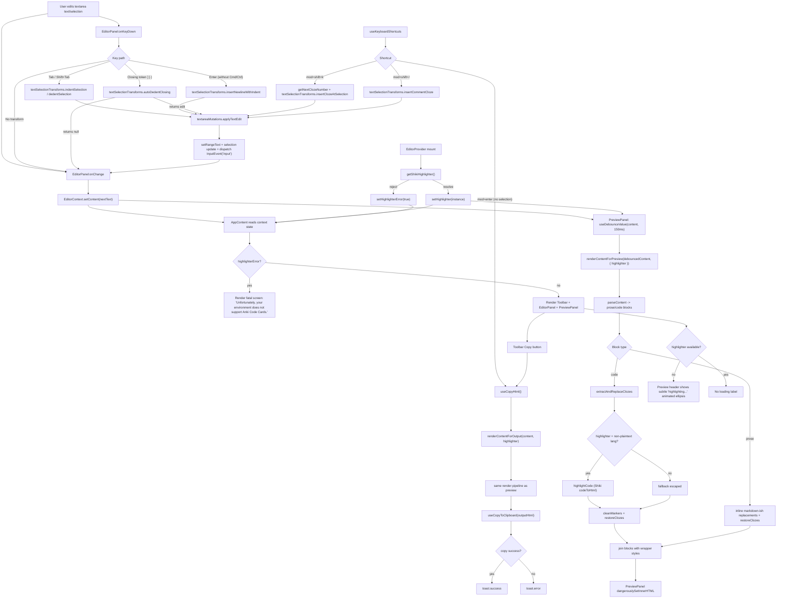

# Hopefully Final Data Flow

## Scope
This describes the runtime data flow from text entered in the editor textarea through:
1. Preview rendering in the right panel.
2. HTML generation and clipboard copy for Anki export.

## End-to-End Flow (Mermaid)

## Pipeline Contracts
- Editor input contract:
  - Input: `TextSelectionState` (`text`, `selectionStart`, `selectionEnd`) from textarea DOM.
  - Output: transformed `TextSelectionState` passed to `applyTextEdit`.
- Mutation contract:
  - Input: current textarea value + target edit result.
  - Output: minimal DOM text replacement + selection update + bubbling `input` event.
- Render contract (preview and output):
  - Input: raw markdown-like content + optional Shiki highlighter.
  - Output: full HTML string with inline styles and restored raw cloze markers (`{{cN::...}}`).
- Copy contract:
  - Input: rendered output HTML string.
  - Output: clipboard write success/failure + toast feedback.

## Notes on Current Behavior
- Preview is intentionally debounced by `150ms` to reduce render churn while typing.
- Loading UI is preview-only and subtle (`highlighting...` with animated ellipsis).
- Highlighter initialization failure is fatal for the app shell (`highlighterError` path).
- If rendering executes while highlighter is `null`, code blocks still render via escaped `<pre><code>` fallback.
